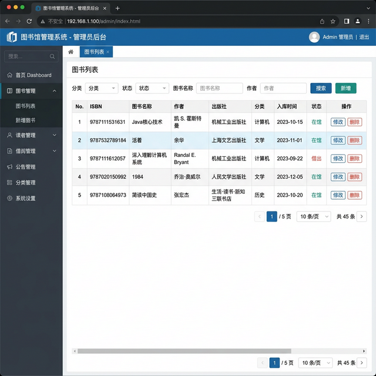
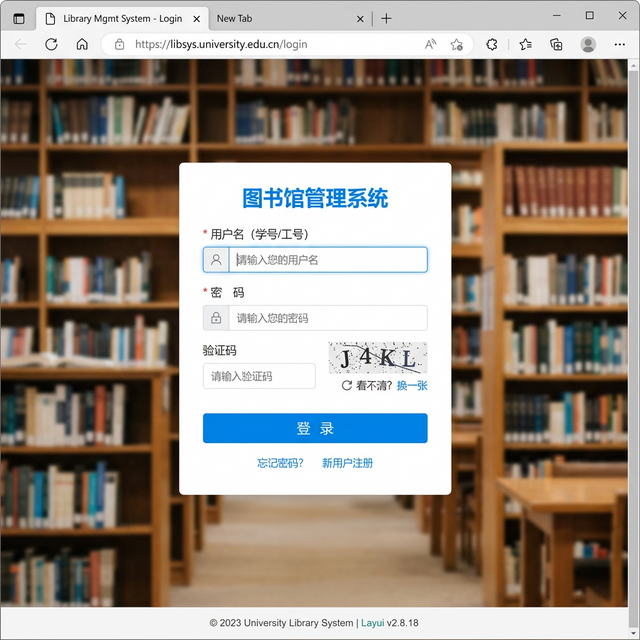

# 图书馆管理系统

 


学校或小型图书馆日常运营中，图书的入库登记、读者借还书记录、逾期提醒等事务如果还用纸质登记本或 Excel 来管理，不仅效率低下，而且数据容易出错丢失。本项目用 Java SSM 框架搭建了一套图书馆管理系统，管理员可以在线管理图书、读者、借阅记录和系统公告，读者可以检索图书和查看个人借阅信息。

## 痛点与目的

- **问题**：人工记录图书借还信息繁琐易错，库存统计费时，逾期催还全靠人盯人
- **方案**：用 SSM（Spring + SpringMVC + MyBatis）搭建 Web 管理系统，图书入库/借出/归还全部在线操作，数据实时存储在 MySQL
- **效果**：管理员后台统一操作，读者前台可查询和借书，支持数据统计和公告发布

## 系统界面



### 登录页面



## 核心功能

- **图书管理**：图书信息的增删改查，按分类、书名等检索
- **读者管理**：读者信息的注册、编辑和管理
- **借阅管理**：借书、还书、查看借阅记录
- **分类管理**：图书分类的增删改查
- **公告管理**：系统公告的发布和管理
- **管理员管理**：管理员账号的增删改，支持超级管理员
- **统计分析**：借阅数据的统计展示
- **密码修改**：用户密码自助修改

## 使用方法

### 环境要求

- JDK 1.8+
- Maven
- MySQL 5.7+
- Tomcat 8+

### 数据库初始化

```sql
-- 创建数据库并导入 SQL 文件
CREATE DATABASE library;
USE library;
SOURCE library(1).sql;
```

### 配置数据库连接

修改 `library-system-master/src/main/resources/db.properties` 中的数据库连接信息。

### 编译运行

```bash
cd library-system-master
mvn clean package
```

将生成的 WAR 包部署到 Tomcat，或在 IDE 中直接运行。

### 默认账号

| 角色 | 用户名 | 密码 |
|------|--------|------|
| 超级管理员 | admin | 12345 |

## 项目结构

```
.
├── library-system-master/
│   ├── src/main/
│   │   ├── java/com/yx/
│   │   │   ├── controller/       # 控制器层
│   │   │   ├── service/          # 业务逻辑层
│   │   │   ├── dao/              # 数据访问层
│   │   │   ├── entity/           # 数据实体类
│   │   │   ├── constants/        # 常量定义
│   │   │   └── codeutil/         # 工具类
│   │   ├── resources/
│   │   │   ├── spring.xml        # Spring 配置
│   │   │   ├── springmvc.xml     # SpringMVC 配置
│   │   │   └── db.properties     # 数据库连接配置
│   │   └── webapp/
│   │       ├── WEB-INF/pages/    # JSP 页面
│   │       │   ├── book/         # 图书管理页面
│   │       │   ├── reader/       # 读者管理页面
│   │       │   ├── lend/         # 借阅管理页面
│   │       │   ├── admin/        # 管理员管理页面
│   │       │   ├── notice/       # 公告管理页面
│   │       │   ├── type/         # 分类管理页面
│   │       │   └── count/        # 统计页面
│   │       └── lib/              # 前端依赖（Layui, jQuery等）
│   └── pom.xml                   # Maven 依赖
└── library(1).sql                # 数据库初始化脚本
```

## 适用场景

- 学校图书馆管理
- 小型社区图书室
- 企业内部图书借阅
- Java SSM 全栈开发学习

## 技术栈

| 层级 | 技术 |
|------|------|
| 后端框架 | Spring + SpringMVC + MyBatis |
| 前端 | JSP + Layui + jQuery |
| 数据库 | MySQL |
| 构建 | Maven |
| 服务器 | Tomcat |

## 许可证

MIT 许可证
